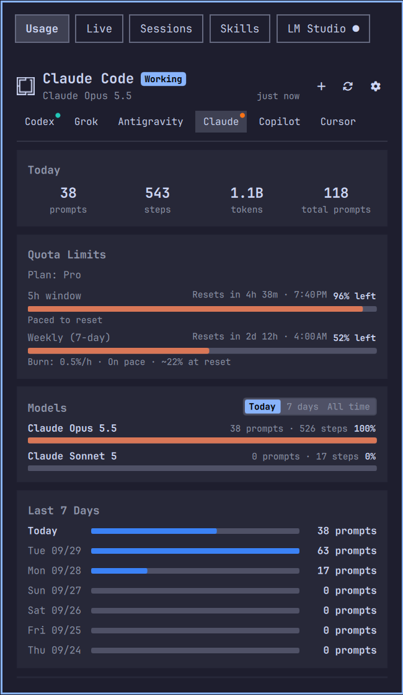

# AI Hub for Omarchy

One Omarchy bar icon for your AI tooling. Click it for a tabbed panel with five pages:

| Tab | What it shows |
| --- | --- |
| **Usage** | Today's usage, seven-day history, models, quotas and recent sessions for Codex, Grok, Antigravity, Claude Code, GitHub Copilot and Cursor |
| **Live** | Running [herdr](https://github.com/herdrdev/herdr) sessions, the project and agents in each, and which agents are waiting on you |
| **Sessions** | Past sessions from Claude Code, Codex, opencode, Copilot, Pi, Gemini and Grok, to resume, peek at, open or delete |
| **Skills** | The skills Claude Code, OpenCode and Codex load, what they cost in context, with your own categories and notes |
| **Local** | Your local model servers, LM Studio and Ollama: start or stop each, load and unload models, copy the server URL, and watch GPU, VRAM, CPU and RAM use |

The panel opens on Usage, or on the first tab you haven't hidden.



## The bar icon

- Coloured dots around the icon pulse for each agent with a live session.
- A number shows the live-session count or today's prompts (set on the Usage tab).
- A filled dot shows herdr state, in your theme's urgent colour when an agent is waiting on you.
- A ring means LM Studio or Ollama is running.

Hover the icon for a summary of all of it.

## Requirements

- [Omarchy](https://omarchy.org/)
- Python 3
- Each tab needs its own tool, and shows a status message when that tool is missing:
  - **Usage** and **Sessions:** at least one agent CLI you have used, such as `claude`, `codex`, `copilot` or `grok`
  - **Live:** [herdr](https://github.com/herdrdev/herdr)
  - **Local:** [LM Studio](https://lmstudio.ai/) with its `lms` CLI, [Ollama](https://ollama.com/) (`sudo pacman -S ollama`), or both

## Install

```bash
omarchy plugin add https://github.com/design-nexus/omarchy-ai-hub.git --enable
```

`--enable` adds the icon to the bar. To move it:

```bash
omarchy bar move design-nexus.ai-hub --section right
```

Use `left`, `center` or `right`; `--before` and `--after` place it next to another widget.

## Use

| Input | Action |
| --- | --- |
| Left-click | Open or close the panel |
| Right-click | Open the Local tab |
| Middle-click | Refresh usage, herdr and the local servers |
| `Alt+1`–`Alt+5` | Jump to a tab |
| `Alt+0` | Open or close the hub settings |
| `Ctrl+Tab` / `Ctrl+Shift+Tab` | Next / previous tab |
| `Tab` / `Shift+Tab` | Next / previous tab, then on to the neighbouring bar panel |
| `Esc` | Close |

Each tab keeps its own keys. The ones worth knowing:

- **Usage:** `1`–`5` resume a recent session, `n` starts a new one, `r` refreshes, `s` opens settings.
- **Sessions:** `Enter` resumes, `p` peeks at the transcript, `o` opens the folder, `y` copies the ID, `d` twice deletes, `←`/`→` filter by agent, `r` rescans.
- **Local:** `↑`/`↓` move through both servers, `Enter` acts on the selection, and `s` starts or stops, `r` refreshes, `o` opens (LM Studio's app, or a chat with the selected Ollama model), `u` unloads and `c` copies, all for the server under the cursor.
- **Live:** click a session to focus its window (or open one), or click an agent to land on its pane. A herdr card can be pinned to the desktop and stays after the panel closes.

## Settings

The gear at the right of the tab row opens the hub settings. Changes save straight away.

- **Tabs:** show or hide Usage, Live, Sessions, Skills and Local. A hidden tab isn't loaded, so it stops polling and its indicator leaves the bar icon. The last visible tab can't be hidden.
- **Local:** show LM Studio, Ollama or both. A hidden server isn't polled.

The Usage tab keeps its own settings (press `s` on it). The Local tab also reads these optional keys from the `local` object in this widget's entry in `~/.config/omarchy/shell.json`:

| Key | Default | Meaning |
| --- | --- | --- |
| `lmsPath` | `~/.lmstudio/bin/lms` | Path to LM Studio's CLI |
| `ollamaUrl` | `http://127.0.0.1:11434` | Ollama server to manage |
| `refreshIntervalSec` / `ollamaRefreshSec` | `30` | Background polling for each server, in seconds |
| `terminalCommand` | `xdg-terminal-exec` | Terminal for Ollama's Chat button |

Ollama's start and stop use its systemd service when there is one, so a system service asks for your password. Without a service, the hub runs `ollama serve` itself. Models loaded from the panel stay loaded until you unload them.

### From a script or keybinding

```bash
omarchy-shell design-nexus.ai-hub toggle
omarchy-shell design-nexus.ai-hub page sessions  # usage, live, sessions, skills, local, settings
omarchy-shell design-nexus.ai-hub refresh
```

`open`, `close` and `current` are also available.

## Privacy

Sessions, usage and skills are read from local files and CLI output, and LM Studio and Ollama are reached on localhost (or the `ollamaUrl` you set). Some quota figures come from the provider's own account API, using the sign-in the agent CLI (or `gh` for Copilot) already has. Conversation contents are never uploaded, and quotas appear only when a provider reports them; nothing is estimated.

The Skills tab never edits a skill or agent config. It writes only its own categories and notes, under `~/.config/agent-skills`.

## Update or remove

```bash
omarchy plugin update design-nexus.ai-hub
omarchy plugin remove design-nexus.ai-hub
```

## License

[MIT](LICENSE). The tabs are modified copies of MIT-licensed Omarchy plugins; see [THIRD_PARTY_NOTICES.md](THIRD_PARTY_NOTICES.md) for their authors.
